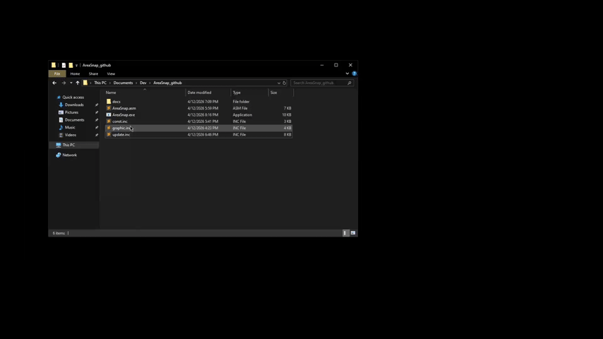

AreaSnap
=========
The program is designed to replace the default ScreenSketch in Windows, extend its functionality, and improve performance.

Control
--------
* Press **MOUSE1** to capture an area for the snap
* ~~Press **TAB** to switch between record/capture~~ 	
* ~~Move **MOUSE3** when capturing to extend an area for the snap~~
* ~~Press **'1-4'** to change the image file extension to .png/.jpeg/.gif/.bmp respectively~~
* Press **CTRL+V** to paste a photo 
* Press **ESC** to close the program

About
=====
The program uses an internet connection every time it is launched, which may trigger antivirus software.             
For image capture, it uses WinAPI functions, while the encoder provides various output file formats.                   
Double buffering is also implemented to ensure smooth animation.           

Json
-----
Soon.

Autoupdate
----------
The program also features automatic updates and hash verification, so once downloaded, it will update itself when a new release is available.

Telegram: https://t.me/ComputerGe3k
